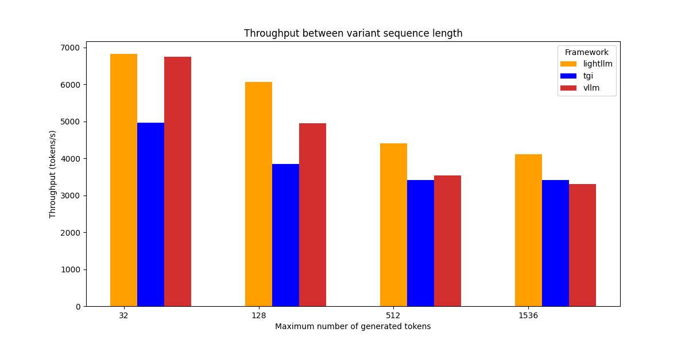
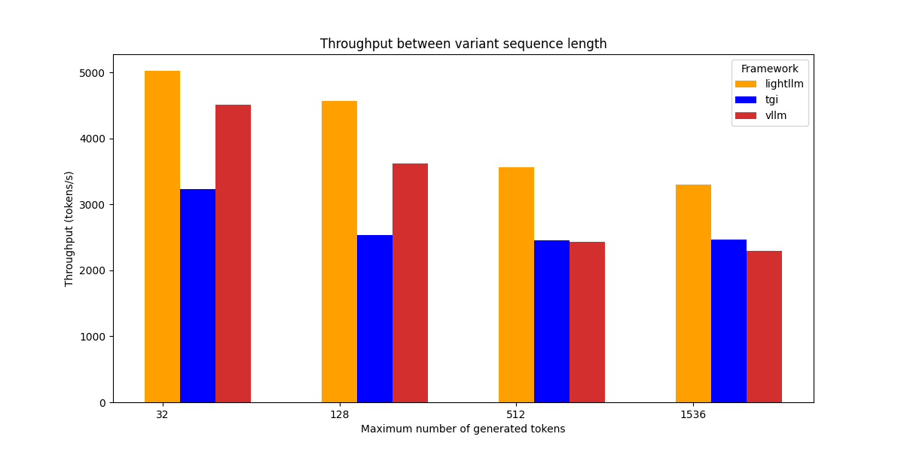
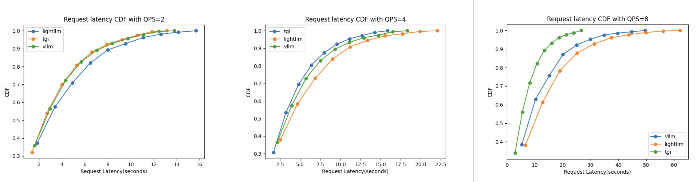
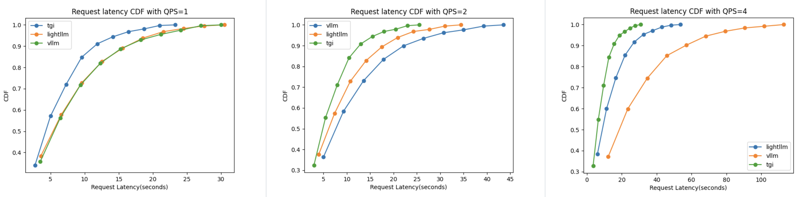

# llm-infer-bench

This repository provides benchmarking tools for different LLM serving backends. Below are the steps to set up each server and run the benchmarks.

## TGI
### Setup
Follow the [TGI repo](https://github.com/huggingface/text-generation-inference/tree/main)[^1] for initial setup. Then, launch the server using Docker:

13B Model with 1 GPU

```bash
docker run -itd --name tgi_test \
    --env CUDA_VISIBLE_DEVICES=7 \
    --gpus all \
    --shm-size 1g \
    -p 18080:80 \
    -v /data0/home/models:/data \
    ghcr.io/huggingface/text-generation-inference:1.0.2 \
    --model-id /data/Llama-2-13b-hf \
    --sharded false \
    --max-input-length 1024 \
    --max-total-tokens 68700 \
    --max-concurrent-requests 10000
```

70B Model with 4 GPUs

```bash
# 70B Model
docker run -itd --name tgi_test \
    --env CUDA_VISIBLE_DEVICES=4,5,6,7 \
###     --gpul
    --shm-size 1g \
    -p 18080:80 \
    -v /data0/home/models:/data \
    ghcr.io/huggingface/text-generation-inference:1.0.2 \
    --model-id /data/Llama-2-70b-chat-hf \
    --sharded true \
    --num-shard 4 \
    --max-input-length 1024 \
    --max-total-tokens 387000 \
    --max-concurrent-requests 10000
```

Benchmarking TGI

```bash
# throughput
bash benchmark_configs/tgi_variable_size_throughput.sh

# latency6
bash benchmark_configs/tgi_variable_size_latency.sh
```

## vLLM
### Setup
Follow the [vLLM repo](https://github.com/vllm-project/vllm/tree/791d79de3261402fae1b9d0b1650655071a68095)[^2] for initial setup. Then start the server:

13B Model with 1 GPU

```bash
CUDA_VISIBLE_DEVICES=1 python3 -m vllm.entrypoints.api_server \
        --port 18081 \
        --max-num-batched-tokens 18700 \
        --model /data/Llama-2-13b-hf
```

70B Model with 4 GPUs

```bash
CUDA_VISIBLE_DEVICES=4,5,6,7 python3 -m vllm.entrypoints.api_server \
        --port 18081 \
        --model /data/Llama-2-70b-chat-hf \
        --max-num-batched-tokens 8700 \
        --tensor-parallel-size 4
```
### Benchmark
```bash
# through
bash benchmark_configs/vllm_variable_size_throughput.sh

# latency
bash benchmark_configs/vllm_variable_size_latency.sh
```

## LightLLM
### Setup
Follow the [lightllm repo](https://github.com/ModelTC/lightllm)[^3] for initial setup. Then start the server:

13B Model with 1 GPU

```bash
CUDA_VISIBLE_DEVICES=0 python3 -m lightllm.server.api_server \
	--port 18082 \
	--model_dir /data/Llama-2-13b-hf/ \
	--max_total_token_num 68700
```

## Run lightLLM

```bash
CUDA_VISIBLE_DEVICES=4,5,6,7 python3 -m lightllm.server.api_server \
        --port 18082 \
        --model_dir /data/Llama-2-70b-chat-hf \
        --max_total_token_num 387000 \
        --tp 4
```

### Benchmark
```bash
# throughput
bash benchmark_configs/lightllm_variable_size_throughput.sh

# latency
bash benchmark_configs/lightllm_variable_size_latency.sh
```

## Benchmarking Results
All benchmarks were conducted on an NVIDIA A800-SXM4-80GB GPU connected via PCIe. We evaluated both 13B and 70B models.

### Throughput
We used the dummy dataset consisting of 1,000 sequences, each containing 512 input tokens. The model was configured to generate per-sequences with a maximum length (max_tokens) by ignoring the End-of-Sequence (EoS) token.

To introduce variability in the generated sequence lengths, we sampled the response length from an [exponential distribution](https://en.wikipedia.org/wiki/Exponential_distribution) with a mean of 128 tokens. We conducted tests with truncated lengths, considering only samples from the exponential distribution that are less than or equal to 32, 128, 512, and 1536. The total output sequence length is then, at most, 512+32=544, 512+128=640, 512+512=1024, and 512+1536=2048 (the maximum sequence length of model setting).

We employed a Python benchmarking script using [asyncio](https://docs.python.org/3/library/asyncio.html) to send HTTP requests to the model server. All requests were submitted in a burst to saturate the compute resources.

The reuslts are as follows:

13B Model

| Throughput (token/s) vs. variance in length | max 32 tokens | max 128 tokens | max 512 tokens | max 1536 tokens |
|:--|:--|:--|:--|:--|
| TGI | 4937.88 | 3837.65 | 3391.885 | 3307.23 |
| vLLM | 6841.49 | 5086.82 | 3533.67 | 3325.49 |
| lightLLM | 6821.80 | 6063.72 | 4404.93 | 4102.28 |



70B Model

| Throughput (token/s) vs. variance in length | max 32 tokens | max 128 tokens | max 512 tokens | max 1536 tokens |
|:--|:--|:--|:--|:--|
| TGI | 3197.48 | 2532.61 | 2422.75 | 2325.35 |
| vLLM | 4514.55 | 3615.29 | 2429.91 | 2300.71 |
| lightLLM | 5024.78 | 4562.66 | 3568.23 | 3297.87 |




### Latency
Latency is a critical metric for live-inference endpoints as it directly impacts user experience. We measure how the [cumulative distribution function](https://en.wikipedia.org/wiki/Cumulative_distribution_function) of latencies varies across different serving frameworks.

As with throughput testing, the model is configured to ignore the `EoS` token and generate sequences of a specified length. We use a dataset of 1,000 randomly sampled prompts, with lengths sampled from a [uniform distribution](https://en.wikipedia.org/wiki/Uniform_distribution) ranging from 1 to 512 tokens. The output lengths are sampled from a capped exponential distribution with a mean of 128 and a maximum size of 512 tokens. These parameters were selected for their realistic representation of typical workloads.

Unlike the throughput benchmark, where all requests are submitted simultaneously, here we stagger the requests. The time between each request is determined by sampling a [Poisson distribution](https://en.wikipedia.org/wiki/Poisson_distribution). This setup allows us to evaluate how each serving framework performs under varying Query Per Second (QPS) loads.

13B Model

| generation request latency vs. QPS |  QPS=2 | QPS=4 | QPS=8 |
|:--|:--|:--|:--|
| TGI | 0.0256 (2.3892) | 0.0322 (2.9769) | 0.0542 (4.8202) |
| vLLM | 0.0260 (2.4723) | 0.0348 (3.2986) | 0.0825 (7.4093) |
| lightLLM | 0.0337 (2.7406) | 0.0453 (3.7370) | 0.1257 (9.5245) |



70B Model

| generation request latency vs. QPS | QPS=1 | QPS=2 | QPS=4 |
|:--|:--|:--|:--|
| TGI | 0.0456 (4.1999) | 0.0515 (4.7381) | 0.0633 (5.7956)  |
| vLLM | 0.0578 (5.4908)  | 0.0835 (7.7701) | 0.2079 (18.6611) |
| lightLLM | 0.0627 (5.1785) | 0.0712 (5.8945) | 0.1077 (8.7133) |




## Acknowledgements

- [llm-continuous-batching-benchmarks](https://github.com/anyscale/llm-continuous-batching-benchmarks)
- [vLLM](https://github.com/vllm-project/vllm/tree/791d79de3261402fae1b9d0b1650655071a68095)
- [TGI](https://github.com/huggingface/text-generation-inference/tree/main)
- [LightLLM](https://github.com/ModelTC/lightllm)

- [^1]: docker image: ghcr.io/huggingface/text-generation-inference:1.0.2
- [^2]: commit_id: 28873a2799ddfdd0624edd4619e6fbeeb49cd02c
- [^3]: commit_id: 718e6d6dfffc75e7bbfd7ea80ba4afb77aa27726